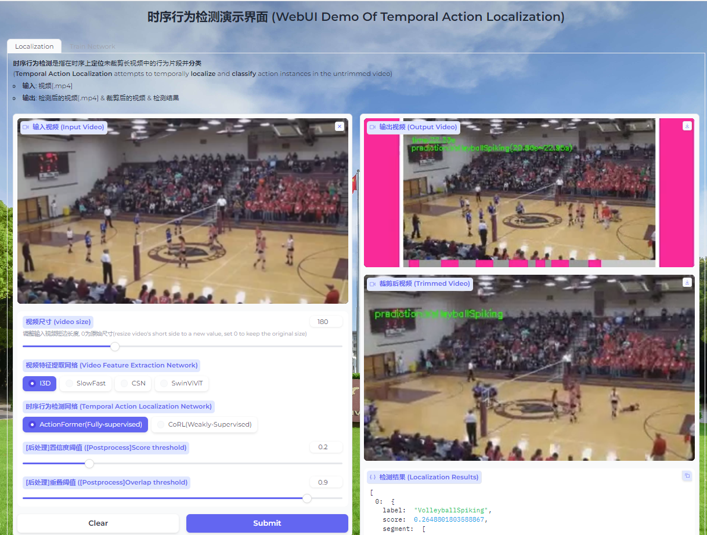

# A Demo for Temporal Action Localization
<p>
  
</p>

## 1.Enviroment
## 1.1 create conda environment & install pytorch
```bash
conda create --name tal_app python=3.8
conda activate tal_app
pip install torch==1.10.0+cu111 -f https://download.pytorch.org/whl/torch_stable.html
pip install torchvision==0.11.0+cu111 torchaudio==0.10.0 -f https://download.pytorch.org/whl/torch_stable.html
```

## 1.2 install mmaction2
1.install MMEngine, MMCV, using MIM.
```bash
pip install -U openmim
mim install mmengine
<!-- mim install mmcv -->
pip install mmcv-full==1.3.18 -f https://download.openmmlab.com/mmcv/dist/cu111/torch1.10.0/index.html
```

2.Install MMAction2.
```bash
cd Video-Swin-Transformer
pip install -v -e .
cd ..
```

## 1.3 install denseflow (option*)(install if optical flow is needed)
https://github.com/open-mmlab/denseflow/blob/master/INSTALL.md


## 1.4  Compilation of nms

Part of NMS is implemented in C++. The code can be compiled by

```shell
cd ./tal_alg/actionformer/libs/utils
python setup.py install --user
```

## 1.5 install requirements
pip install -r requirements.txt

## 2.Training(option*)
- Extract RGB and Flow
RGB:
```bash
python extract_rawframes.py ./tmp/video/ ./tmp/rawframes/ --level 1 --ext mp4 --task rgb --use-opencv
```

- Extract features
Some videos are too long and cannot be loaded into memory when running in parallel. 
Filtering out the overly-long videos by param 'max-frame',the overly-long videos will be divided to <max-frame> picies.
```bash
cd dataset
python extract_datasets_feat.py --gpu-id <gpu> --part <part> --total <total>  --resume --max-frame 10000
```
## 3.Download examples and checkpoint
- ckpt for backbone in ./backbone/download.py
- ckpt for actionformer

## 4.Demo built with gradio
- set demo.launch(share=True) if you want to share your app to others.
- The whole process runs on the host server so the client(PC,Android,apple...) does not need to install the environment.
```bash
python main.py
```
